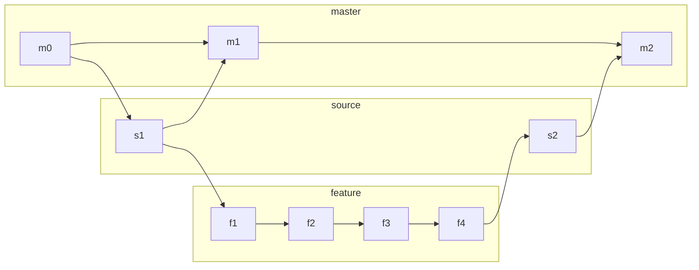

Nodes with id matching:
- *m[0-9]{1,}* are commits with fully build README.md
- *s[0-9]{1,}* are commits from witch new README.md will be build when github action trigger
- *m[0-9]{1,}* are commits that will eventualy be merged to branch **source** but README is not yet ready and could break
(I wonder isn't this an overkill?)